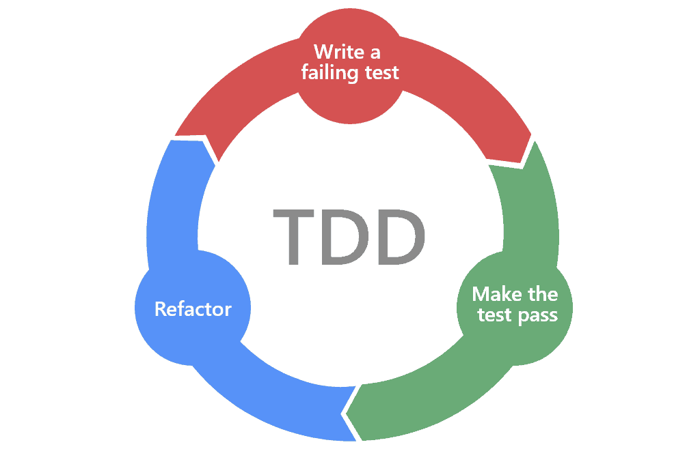

# TDD : 테스트 주도 개발
### Test Driven Development
<hr/>

### 개념
> 개발 프로세스에서 테스트 코드를 먼저 작성하고  
> 그 테스트를 통과하는 코드를 나중에 작성하는 방법론
#

### 진행순서

1. 실패하는 테스트를 작성 (RED)
2. 테스트를 성공하도록 수정 (GREEN)
3. 성공한 테스트에서 중복을 제거하거나, 가독성을 올리는 등 리팩토링을 수행  
#
### 장점
> * 개발 초기 단계에서 버그를 발견하고 수정하는 것에 중점
> * 코드가 내 손을 벗어나기 전에 가장 빠르게 피드백 받을 수 있다
> * 개발자에게 요구사항을 명확하게 이해하도록 코드를 강제하여 유지보수에 유리하도록 이끔
>   * 내가 어떤 로직을 만드는지
>   * 내가 의도한 행위를 하는지 명확하게 이해할 수 있다
> * 설계를 개선하고 리팩토링을 촉진하도록 함
>   * 결국엔 테스트코드를 쉽게짜려고 로직 자체를 외부에서 간편하게 쓰도록 짠다.
#
### 좋은 테스트?
> Fast: 테스트는 빠르게 동작하여 자주 돌릴 수 있어야 한다.  
> Independent: 각각의 테스트는 독립적이며 서로 의존해서는 안된다.  
> Repeatable: 어느 환경에서도 반복 가능해야 한다.  
> Self-Validating: 테스트는 성공 또는 실패로 bool 값으로 결과를 내어 자체적으로 검증되어야 한다.  
> Timely: 테스트는 적시에 즉, 테스트하려는 실제 코드를 구현하기 직전에 구현해야 한다.  

#
### 절차
1. 기능에 대한 실패하는 테스트 케이스를 먼저 작성
```
    @Test
    void tddTest() {
        EntityManager em = entityManagerFactory.createEntityManager();
        EntityTransaction transaction = em.getTransaction();
        transaction.begin();

        StoreVO storeVO = null;

        assertEquals(true, storeVO != null);
        System.out.println("success");

        transaction.commit();
    }
```
```
    java.lang.AssertionError: expected:<true> but was:<false>
    필요  :true
    실제  :false
```
#
2. 테스트가 성공하도록 수정
```
    @Test
    void tddTest() {
        EntityManager em = entityManagerFactory.createEntityManager();
        EntityTransaction transaction = em.getTransaction();
        transaction.begin();
        
        StoreVO storeVO = entityManager.find(StoreVO.class, 1);

        assertEquals(true, storeVO != null);
        System.out.println("success");

        transaction.commit();
    }
```
```
    success
```
#
3. 비즈니스를 늘려서 전체적인 단위 테스트를 작성
```
    @Test
    void tddTest() {
        EntityManager em = entityManagerFactory.createEntityManager();
        EntityTransaction transaction = em.getTransaction();
        transaction.begin();

        StoreVO storeVO = em.find(StoreVO.class, 1);
        storeVO.setStoreNm("수정된 음식점1");

        em.flush();
        em.clear();

        StoreVO storeVO2 = em.find(StoreVO.class, 1);

        assertEquals(true, "수정된 음식점1".equals(storeVO2.getStoreNm()));
        transaction.commit();
    }
```
```
    success
```
#
4. 코드를 중복을 제거하거나, 가독성이 좋도록 코드를 리펙토링
```
    @Test
    void tddTest4() {
        EntityManager em = entityManagerFactory.createEntityManager();
        EntityTransaction transaction = em.getTransaction();
        transaction.begin();

        String modifiedStoreNm = "수정된 음식점1";

        StoreVO storeVO = em.find(StoreVO.class, 1);
        storeVO.setStoreNm(modifiedStoreNm);

        em.flush();
        em.clear();

        StoreVO storeVO2 = em.find(StoreVO.class, 1);

        assertEquals(true, modifiedStoreNm.equals(storeVO2.getStoreNm()));
        transaction.commit();
    }
```
5. 새로운 테스트를 통과하기 위해 프로덕션 코드를 추가 또는 수정
```
    @Test
    void tddJoinTest() {
        EntityManager em = entityManagerFactory.createEntityManager();
        EntityTransaction transaction = em.getTransaction();
        transaction.begin();

        CategoryVO categoryVO = em.find(CategoryVO.class, 1);
        assertEquals(true, "음식점1".equals(categoryVO.getStoreVO().getStoreNm()));
        System.out.println("success");

        transaction.commit();
    }
```
#
5. 1~4단계를 반복하여 실패/성공의 모든 테스트 케이스를 작성
#
6. 개발된 코드들에 대해 모든 중복을 제거하며 리팩토링
#
### TDD는 죽었다
https://sangwook.github.io/2014/04/25/tdd-is-dead-long-live-testing.html
#
### Github Copilot을 이용한 테스트코드
https://effortguy.tistory.com/225
#
### 소감
> 전체적으로 안정적인 기능개발에는 도움을 많이 줄 것 같다  
> 그러나 과연 로직개발과 같거나 이상인 수준의 시간을 투입하면서까지 테스트코드를 작성하는 것은 모든 개발자가 공감하는 듯  
> 장점과 단점이 명확하게 있는 방법론인 만큼 적절히 상황에 맞는 리소스만을 투입해 할 것 같다  
> AI의 테스트코드 작성 기능은 실로 놀라움
> 그러나, 백문이불여일견 백견이불여일행
> 과연 내가 작성하지 않는 테스트코드가 의미가 있을까?
#
