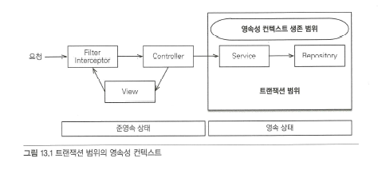
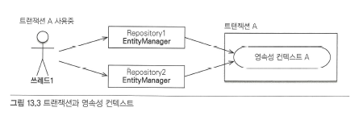
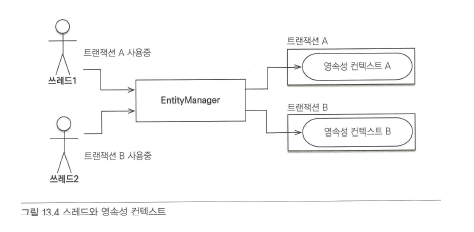
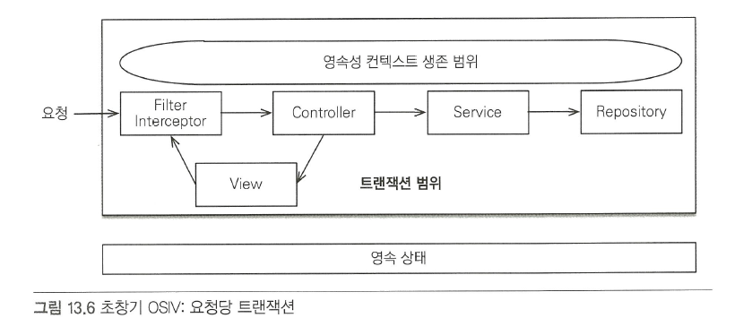
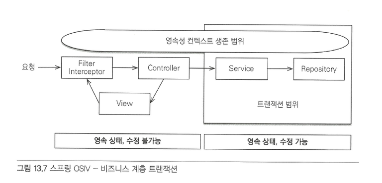
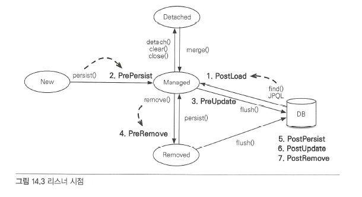

# 객체지향 쿼리 언어
ORM을 사용하면 데이터베이스 테이블이 아닌 엔티티 객체를 대상으로 개발하므로 검색도 테이블이 아닌 객체를 대상으로 하는 방법이 필요하다.

## JPQL 특징
* 테이블이 아닌 객체를 대상으로 검색하는 객체지향 쿼리다.
* 특정 데이터베이스에 의존하지 않는다.
* 오라클 힌트와 같이 데이터베이스에 의존하는 기능이 필요할 때 사용할 수 있는 네이티브 쿼리를 지원한다.

## JPQL 조회
### Fetch Join
SQL의 조인을 의미하는 것은 아니고, JPQL에서 성능 최적화를 위해 제공하는 기능이다. 연관된 엔티티나 컬렉션을 한번에 조회하는 기능이다

```java
// no fetch
TeamEntity t = em.createQuery("SELECT t FROM TeamEntity t join t.users u", TeamEntity.class)
                .getSingleResult();
/*
Hibernate: select te1_0.team_id,te1_0.name from team_entity te1_0 join user_entity u1_0 on te1_0.team_id=u1_0.team
Hibernate: select u1_0.team,u1_0.user_id,u1_0.name from user_entity u1_0 where u1_0.team=?
*/

// fetch join
TeamEntity t = em.createQuery("SELECT t FROM TeamEntity t join fetch t.users u", TeamEntity.class)
                .getSingleResult();
/*
Hibernate: select te1_0.team_id,te1_0.name,u1_0.team,u1_0.user_id,u1_0.name from team_entity te1_0 join user_entity u1_0 on te1_0.team_id=u1_0.team
  */
```

JPA 표준에서는 fetch join 대상에 on 제한이 있다. 다만 일부 구현체 (하이버네이트 등)에서는 허용한다.

1. fetch join JPQL에 on절은 허용하지 않는다.(에러 발생)
2. fetch join 대상은 on, where 등에서 필터링 조건으로 사용면 안된다.

```java
SELECT t FROM TeamEntity t left join fetch t.users u on u.name = '태우'

// 위 같은 경우 users 컬렉션이 전부 조회되지 않으니 일관성이 깨짐
```

### Named 쿼리: 정적 쿼리
미리 정의한 쿼리에 이름을 부여해서 필요할 때 사용할 수 있다.
```java
// user entity
@NamedQueries({
        @NamedQuery(
                name="UserEntity.findByName",
                query="select u from UserEntity u where u.name = :name"
        )
})
public class UserEntity {
...


List<UserEntity> users = em.createNamedQuery("UserEntity.findByName", UserEntity.class)
                .setParameter("name", "태우")
                .getResultList();
```

## Criteria
* 장점: 문자가 아닌 query.select(...).where(..) 처럼 코드로 JPQL 작성가능
* 장점: IDE를 사용하여 코드 자동완성 사용 가능, 동적쿼리 가능, 타입에 안전
* 장점: JPQL의 단점인 런타임 단계에서의 오류 체크를 컴파일 단계에서 할 수 있다.
* 장점: JPQ 표준이므로 별도 설정이 필요 없다.
* 단점: 너무 복잡하고 어렵다
* 단점: 어떠한 JPQL이 표현될지 알기가 어렵다.
```java
public class UserRepository {

    @PersistenceContext
    private EntityManager em;

    @Transactional
    public List<User> findUsersByName(String name) {
        CriteriaBuilder cb = em.getCriteriaBuilder();
        CriteriaQuery<User> cq = cb.createQuery(User.class);
        Root<User> user = cq.from(User.class);
        cq.select(user).where(cb.equal(user.get("name"), name));
        return em.createQuery(cq).getResultList();
    }
}
```

## QueryDSL
* 장점: 동적쿼리 가능, 타입 안전, 가독성이 좋다, 직관적이다.
* 장점: 복잡하면 복잡할 수록 Criteria과의 가독성 차이가 벌어진다.
* 장점: 어떠한 JPQL이 생성될 지 알기가 쉽다.
* 단점: 추가 라이브러리를 사용하고, 설정해야 한다.
```java
@Repository
public class UserRepository {

    @Autowired
    private JPAQueryFactory queryFactory;

    @Transactional
    public List<User> findUsersByName(String name) {
        QUser user = QUser.user;
        return queryFactory.selectFrom(user)
                           .where(user.name.eq(name))
                           .fetch();
    }
}
```

# Spring Data JPA
Spring Framework 환경에서 JPA를 편리하게 사용할 수 있게 지원한다.

## Query Method
### 메소드 이름으로 쿼리 생성
```java
public interface UserRepository extends JpaRepository<UserEntity, String> {
    List<UserEntity> findByName(String name);
}

...

@Test
public void findByNameWhenUserExistsThenReturnUser() {
    UserEntity saved = userRepository.save(UserEntity.builder()
            .userId("twlee")
            .name("hello")
            .build());

    List<UserEntity> hello = assertDoesNotThrow(() -> userRepository.findByName("hello"));

    Assertions.assertThat(hello).hasSize(1);
    Assertions.assertThat(hello.getFirst()).isEqualTo(saved);
    // select ue1_0.user_id,ue1_0.name,ue1_0.team from user_entity ue1_0 where ue1_0.name=?
}
```

### 메소드 이름으로 NamedQuery 호출
```java
@NamedQueries({
        @NamedQuery(
                name="UserEntity.findByName2",
                query="select u from UserEntity u where u.name = :name"
        )
})
public class UserEntity

...

public interface UserRepository extends JpaRepository<UserEntity, String> {
    List<UserEntity> findByName2(String name);
}

...

    @Test
    public void findByName2WhenUserExistsThenReturnUser() {
        UserEntity saved = userRepository.save(UserEntity.builder()
                .userId("twlee")
                .name("hello")
                .build());

        List<UserEntity> hello = assertDoesNotThrow(() -> userRepository.findByName2("hello"));
        //select ue1_0.user_id,ue1_0.name,ue1_0.team from user_entity ue1_0 where ue1_0.name=?
        Assertions.assertThat(hello).hasSize(1);
        Assertions.assertThat(hello.getFirst()).isEqualTo(saved);

        System.out.println("hello = " + hello);
    }
```

### @Query 어노테이션으로 쿼리 정의
```java
@Query("select u from UserEntity u where u.userId = ?1")
    UserEntity findByUserId(String userId);
```

### 수정 쿼리
```java
@Query("update UserEntity u set u.name = :name")
    int updateName(@Param("name") String name);
```

### 커스텀 레포지터리 구현
* 다양한 이유로 위의 편의 기능외의 직접 구현이 필요할 때가 있다.
* 기본 이름 규칙은 레포지터리네임 + Impl로 지어야함 (설정으로 변경가능)

# 영속성 관리
* 순수한 J2SE 환경에서 JPA를 사용하면 직접 엔티티 매니저 및 트랜잭션을 관리해야함
* 스프링이나 J2EE 환경에서는 컨테이너가 제공하는 전략을 따라야함

## 스프링 컨테이너 기본 전략
* 스프링 컨테이너는 트랜잭션 범위의 영속성 컨텍스트 전략을 기본으로 사용한다.
* 트랜잭션을 시작할 때 영속성 컨텍스트를 생성하고 트랜잭션이 끝날 때 영속성 컨텍스트를 종료한다
* 같은 트랜잭션 안에서는 항상 같은 영속성 컨텍스트에 접근한다



### 트랜잭션이 같으면 같은 영속성 컨텍스트


### 트랜잭션이 다르면 다른 영속성 컨텍스트
기본은 스레드마다 다른 트랜잭션을 할당한다



## 준영속 상태와 지연 로딩
* 보통 서비스 계층에서 시작해서 서비스 계층이 끝나는 시점에 트랜잭션이 종료되면서 영속성 컨텍스트도 종료된다.
* 조회한 엔티티가 상위 계층(프레젠테이션 계층 등)에서는 준영속 상태가 된다.
```java
@Test
void detachTest() {
    UserEntity user = UserEntity.builder()
            .userId("twlee")
            .name("태우")
            .build();
    em.persist(user);

    UserEntity found = em.find(UserEntity.class, "twlee");

    Assertions.assertThat(found).isEqualTo(user);

    em.detach(found);

    System.out.println("found = " + found.getTeam());
    System.out.println("found = " + found.getTeam().getName());
}
```
위와 같이 준영속상태에서는 지연로딩 설정해둔 엔티티는 불러와지지 않고 NPE 발생한다

## 준영속 상태 지연 로딩 해결 전략
* 필요한 엔티티를 미리 로딩
* OSIV를 사용하여 엔티티를 항상 영속 상태로 유지

### 1. 글로벌 페치 전략 수정
```java
@ManyToOne(fetch = FetchType.EAGER)
```
위와 같이 Fetch전략을 즉시 로딩으로 변경한다

단점
* 사용하지 않는 엔티티를 로딩한다
* N+1 문제 발생
```java


List<UserEntity> list = em.createQuery("select u from UserEntity u", UserEntity.class).getResultList();

Hibernate: select ue1_0.user_id,ue1_0.name,ue1_0.team from user_entity ue1_0
Hibernate: select te1_0.team_id,te1_0.name from team_entity te1_0 where te1_0.team_id=?
Hibernate: select te1_0.team_id,te1_0.name from team_entity te1_0 where te1_0.team_id=?
Hibernate: select te1_0.team_id,te1_0.name from team_entity te1_0 where te1_0.team_id=?
```

### 2. JPQL 페치 조인
```java

List<UserEntity> list = em.createQuery("select u from UserEntity u join Fetch u.team", UserEntity.class).getResultList();

Hibernate: select ue1_0.user_id,ue1_0.name,t1_0.team_id,t1_0.name from user_entity ue1_0 join team_entity t1_0 on t1_0.team_id=ue1_0.team
```
1번에서 fetch join 추가 하면 된다

단점
* 사용 처에 따라 repository method가 무분별하게 증가 할 수 있음

### 3. 강제로 초기화
영속화 상태일 때 강제로 필요한 엔티티를 초기화(조회)한다.

단점
* 프리젠테이션 계층에서의 역할을 서비스 계층이 담당하게 되므로 역할을 침범한다
* 위의 경우를 해결하기 위해 새로운 계층으로 분리가 필요함
* 이 또한 필요에 따라 계속 생겨날 수 있음

## OSIV
위의 모든 문제는 프리젠테이션 계층에서 엔티티가 준영속 상태이기 때문에 발생한다

### 과거 OSIV: 요청 당 트랜잭션


요청이 들어오면 필터,인터셉터에서 영속성 컨텍스트 및 트랜잭션을 만들고 요청이 끝날 때 함께 종료한다. 이로 인해 프리젠테이션 계층에서 엔티티를 변경이 가능해지는 단점이 있다

보완 방법
* 엔티티를 읽기 전용 인터페이스로 제공
* 엔티티의 읽기 전용 메서드만 가지고 있는 랩핑 객체를 제공
* 엔티티 대신 DTO를 반환

### 스프링 OSIV: 비즈니스 계층 트랜잭션
`OpenEntityManagerInViewFilter` 혹은 `OpenEntityManagerInViewInterceptor`를 등록하여 사용한다



요청이 들어오면 영속성 컨텍스트는 생성하지만, 트랜잭션은 생성하지 않는다.

1. 클라이언트의 요청이 들어오면 서블릿 필터나, 스프링 인터셉터에서 영속성 컨텍스트를 생성한다. 단 이때 트랜잭션은 시작하지는 않는다.
2. 서비스 계층에서 @Transactional로 트랜잭션을 시작할 때 1번에서 미리 생성해둔 영속성 컨텍스트를 찾아와서 트랜잭션을 시작한다.
3. 서비스 계층이 끝나면 트랜잭션을 커밋하고 영속성 컨텍스트를 플러시한다. 이때 트랜잭션은 끝내지만 영속성 컨텍스트는 종료하지 않는다.
4. 컨트롤러와 뷰까지 영속성 컨텍스트가 유지되므로 조회한 엔티티는 영속 상태를 유지한다.
5. 서블릿 필터나, 스프링 인터셉터로 요청이 들어오면 영속성 컨텍스트를 종료한다. 이때 플러시를 호출하지 않고 바로 종료한다.

### 트랜잭션 없이 읽기
엔티티를 변경않고 단순 조회할 때는 트랜잭션이 없어도 된다. 프록시를 초기화 하는 지연 로딩도 조회 기능이므로 트랜잭션 없이 읽기가 가능하다.

* 영속성 컨텍스트를 프리젠테이션 계층까지 유지한다.
* 프리젠테이션 계층에는 트랜잭션이 없으므로 엔티티를 수정할 수 없다.
* 프리젠테이션 계층에는 트랜잭션에 없지만 트랜잭션 없이 읽기를 사용해서 지연로딩을 할 수 있다.

### 주의 사항

프리젠테이션 계층에서 엔티티를 수정한 후 종료해도 수정이 일어나지 않지만 (서비스 계층에서 이미 커밋되었으므로), 트랜잭션을 시작하는 서비스 계층을 호출하면 변경 감지로 인해 반영된다.
```java
class MemberController {
	public String viewMember(Long id) {
		Member member = memberService.getMember(id);
		member.setName("XXX"); // 보안상의 이유로 고객 이름을 XXX로 변경했다.

		memberService.biz(); // 비즈니스 로직
		return "view";
	}
}
```

단순한 해결방법은 트랜잭션관련 비즈니스 로직을 선 호출 이후 엔티티를 변경하면 변경이 일어나지 않는다.
```java
class MemberController {
	public String viewMember(Long id) {
		memberService.biz(); // 비즈니스 로직

		Member member = memberService.getMember(id);
		member.setName("XXX"); // 보안상의 이유로 고객 이름을 XXX로 변경했다.

		return "view";
	}
}
```

## 정리

### OSIV 특징
* 한번 조회한 엔티티는 요청이 끝날 때까지 유지
* 엔티티 수정은 트랜잭션 계층에서만 이뤄짐

### OSIV 단점
* 여러 트랜잭션이 같은 영속성 컨텍스를 공유하므로 주의해야함
* 프리젠테이션에서 지연로딩에 의한 SQL이 실행되므로 쿼리튜닝에 주의

### 컬렉션과 부가 기능
## Collection, List
* 단순히 저장만 진행
* 지연 로딩된 컬렉션을 초기화 하지 않는다.

## Set
* HashSet은 중복을 허용하지 않으므로, equlas, hashcode를 이용하여 동일성 비교를 매번 진행
* 또한 엔티티를 추가할 때 지연 로딩된 컬렉션을 초기화한다.

## List + @OrderColumn
순서가 의미 있는 데이터베이스에 순서 값을 저장해서 조회 할때 사용

```java
@Entity
public class Board {

	@Id @GeneratedValue
	private Long id;

	...

	@OneToMany(mappedBy = "board")
	@OrderColumn(name = "POSITION")
	private List<Comment> comments = new ArrayList<Comment>();

}
```
단점이 많아서 실무에선 사용하지 않는다.
* Comment 자체에 Position값이 없으므로 position을 업데이트하는 쿼리가 추가 발생
* List변경시 많은 위치 값 변동으로 업데이트 쿼리 다수 발생
* List의 특정 인덱스를 삭제하면, 2번 위치에 null이 보관되어 컬렉션 순회시 npe 발생

## @OrderBy
```java
@Entity
public class Team {

	@Id @GeneratedValue
	private Long id;
	private String name;

	@OneToMany(mappedBy = "team")
	@OrderBy("username desc, id asc")
	private Set<Member> members = new HashSet<Member>();
	...
}
```

@OrderColumn은 컬럼을 이용하여 관리하였다면, Orderby는 쿼리의 OrderBy절을 이용함, 하이버네이트에서는 Set에 OrderBy사용시 LinkedHashSet을 내부 구현체로 사용

## Converter
```java
public class ProductEntity {

    @Id
    @GeneratedValue(strategy = GenerationType.SEQUENCE)
    private Long productId;

    private String name;

    private BigDecimal price;

    @Convert(converter = BooleanToYNConverter.class)
    private Boolean isSoldOut;

    @Builder
    public ProductEntity(Long productId, String name, BigDecimal price, Boolean isSoldOut) {
        this.productId = productId;
        this.name = name;
        this.price = price;
        this.isSoldOut = isSoldOut;
    }
}

...

@Converter
public class BooleanToYNConverter implements AttributeConverter<Boolean, String> {
    @Override
    public String convertToDatabaseColumn(Boolean attribute) {
        return (attribute != null && attribute) ? "Y" : "N";
    }

    @Override
    public Boolean convertToEntityAttribute(String dbData) {
        return "Y".equals(dbData);
    }
}

...

ProductEntity found = assertDoesNotThrow(() -> productRepository.findById(1L).get());
em.flush();
// insert into product_entity (is_sold_out,name,price,product_id) values ("Y", "테스트상품", 100, 1)
```

필드레벨에도 가능하고, 클래스레벨에도 가능하다

모든 타입에 설정하고 싶으면 `@Converter(autoApply = True)`어노테이션을 컨버터 클래스에 적용한다

# 리스너

JPA 리스너를 이용하면, 엔티티 생명주기에 따라 이벤트를 처리 할 수 있다.

## 이벤트 적용 위치
* 엔티티에 직접 적용
* 별도의 리스너 등록
* 기본 리스너 사용

### 엔티티 직접 적용
```java
public class ProductEntity {

    @Id
    @GeneratedValue(strategy = GenerationType.SEQUENCE)
    private Long productId;

    private String name;

    private BigDecimal price;

    @Convert(converter = BooleanToYNConverter.class)
    private Boolean isSoldOut;

    @PrePersist
    public void prePersist() {
        System.out.println("ProductEntity.prePersist id=" + productId);
    }

    @PostPersist
    public void postPersist() {
        System.out.println("ProductEntity.postPersist id=" + productId);
    }
    ...
```

### 별도 리스너 등록
```java
@EntityListeners(XXXListener.class)
public class ProductEntity {
```

# 엔티티 그래프
글로벌 fetch 옵션은 영향도가 너무 크므로 일반적으로 Lazy를 적용하고, 연관 엔티티를 조회할 때는 JPQL 페치조인을 사용한다. 하지만 불필요한 JPQL이 늘어나는 단점이 있으므로 엔티티 그래프를 사용하여 보완할 수 있다.

## Named 엔티티 그래프
Spring jpa
```java
@NamedEntityGraph(name = "UserEntity.withTeam", attributeNodes = {
        @NamedAttributeNode("team")
})
public class UserEntity {
...

public interface UserRepository extends JpaRepository<UserEntity, String>, UserRepositorySupporter {
    @EntityGraph(value = "UserEntity.withTeam")
    UserEntity findByUserId(String userId);
}
//select ue1_0.user_id,ue1_0.name,t1_0.team_id,t1_0.name from user_entity ue1_0 left join team_entity t1_0 on t1_0.team_id=ue1_0.team where ue1_0.user_id=?
```

JPA
```java
EntityGraph graph = em.getEntityGraph("Order.withMember");

Map hints = new HashMap();
hints.put("javax.persistence.fetchgraph", graph);

Order order = em.find(Order.class, orderId, hints);
```