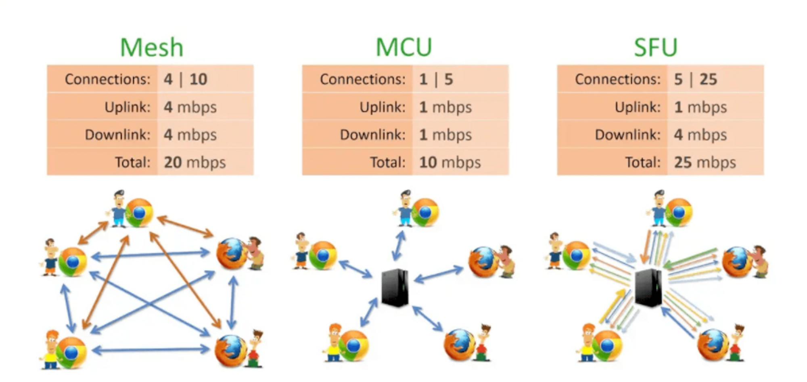

# WebRTC (Web Real-Time Communication)

웹 브라우저와 모바일 애플리케이션에서 **실시간 통신(Real-Time Communication)**을 가능하게 하는 오픈소스

---

## 주요 특징

### 1. **실시간 통신**
저지연으로 오디오와 비디오 데이터를 교환할 수 있는 기술을 제공.  
이를 통해 화상 회의, 음성 통화, 스트리밍 서비스 등을 구현할 수 있음.

### 2. **P2P 통신**
Peer-to-Peer(P2P) 연결을 통해 데이터를 전달하므로 서버 부하가 적음.

### 3. **오픈소스 기반**
Google이 시작한 오픈소스 프로젝트로, 자유롭게 사용 및 커스터마이징이 가능.

### 4. **보안**
DTLS와 SRTP 프로토콜을 사용해 전송되는 데이터를 암호화함으로써 안전한 통신을 보장.

### 5. **낮은 진입장벽**
별도 플러그인이나 미디어 송출 관련 소프트웨어를 설치할 필요가 ㅇ벗어서 진입장벽이 낮음.

---

## WebRTC의 장단점

### 장점
- 플러그인 설치 불필요
- 고성능 P2P 데이터 전송
- 오픈소스 기반으로 커스터마이징 가능
- 브라우저 간 높은 호환성

### 단점
- 방화벽 및 네트워크 환경에 따른 연결 이슈
- 구현 복잡성 증가
- P2P 방식의 데이터 전송으로 대규모 연결 시 부하 발생 가능

---
## 종류

### Mesh
 - 미디어 정보를 직접 peer끼리 connection을 맺어 주고 받는다. 
 - peer끼리 connection을 맺기 위한 시그널 정보를 주고 받기 위한 시그널 서버 필요 
 - 시그널링 서버 구축을 위해 websocket, socket.io와 같은 양방향 통신을 지원하는 기술 사용 
 - peer에 직접 미디어 정보를 주고 받기 때문에 peer(클라이언트)에 부하가 생김 
 - 1:1 구조에 적합

### SFU
 - peer의 부하는 mesh에 비해서 줄어들지만 그만큼 서버의 부하가 있다. 
 - 1개의 upstream과 n개의 downstream을 갖는 구조 
 - 미디어 서버가 필요 
 - 대규모 연결에 적합

### MCU
- peer의 부하가 가장 적다. 
- 서버의 부하는 가장 크다. 
- 1개의 upstream과 1개의 downstream을 갖는 구조 
- 서버에서 peer의 스트림을 모아 인코딩, 디코딩을 하기 때문에 서버에 큰 compute power가 필요 
- 미디어 서버가 필요

---
## WebRTC의 주요 구성 요소

1. **getUserMedia()**
    - 사용자의 카메라, 마이크, 화면 등 미디어 장치를 제어하고 접근하는 API.  
    당연하게도, 캠이 없으면 사용 불가
  

2. **RTCPeerConnection**
    - P2P 연결을 생성하고 관리하는 데 사용됩니다. ICE와 STUN/TURN 서버를 통해 연결 설정을 지원.

  
3. **RTCDataChannel**
    - 텍스트, 바이너리 데이터 등 다양한 형식의 데이터를 실시간으로 전송하기 위한 채널

---

## 주요 단어

1. **ICE(Interactive Connectivity Establishment) candidate**
    - 각 피어에서 연결 가능한 IP(후보)를 수집한 결과물
    - STUN 서버를 통해 얻은 IP 주소
    - TURN 서버를 통해 얻는 릴레이된 주소

2. **Offer**
    - 한쪽 피어가 다른 피어에게 연결 설정을 시작하기 위해 보내는 메시지.
    - A 피어는 createOffer() 메서드를 사용하여 Offer를 생성.
    - Offer를 시그널링 채널(WebSocket 등)을 통해 B 피어에게 전달.

3. **Answer**
    - 다른 피어가 Offer를 받아들였을 때, Offer에 대한 응답으로 보내는 메시지.
    - B 피어는 A 피어의 Offer를 받으면 createAnswer() 메서드를 사용하여 Answer를 생성.
    - Answer를 시그널링 채널을 통해 A 피어에게 전달.

4. **Remote Track**
    - 원격 피어에서 전송된 미디어(오디오, 비디오 등)의 스트림.
    - WebRTC의 RTCPeerConnection 객체는 원격 피어에서 들어오는 미디어를 ontrack 이벤트를 통해 제공.
    - A 피어가 자신의 트랙(MediaStreamTrack)을 RTCPeerConnection에 추가
    - B 피어는 A 피어가 추가한 트랙을 원격 트랙으로 수신하고 이 원격 트랙을 로컬에서 재생
    

5. **Local SDP**
    - 로컬 피어가 생성한 세션 기술(Session Description) 데이터.
    - 상대 피어와의 연결을 협상하기 위해 사용.

---
## 동작 과정 요약

 - Offer 생성 및 전송:
   - A 피어가 createOffer() 호출 → SDP 생성 → B 피어에게 전달.  
    

 - Offer 처리:
   - B 피어가 Offer를 수신 → SDP를 분석 → createAnswer() 호출.

 - Answer 생성 및 전송:
   - B 피어가 SDP 생성 → A 피어에게 전달.

 - SDP 설정:
   - A와 B 피어가 각각 setLocalDescription() 및 setRemoteDescription() 호출 → P2P 연결 설정.

 - 트랙 교환:
   - 각 피어는 트랙을 추가 및 수신하여 미디어 스트림 교환 시작.

---

## 주요 사용 사례

- **화상 회의 및 음성 통화**
    - Zoom, Google Meet, Microsoft Teams 등에서 WebRTC를 활용하여 음성 및 영상 통화를 제공을 위해 사용.

- **라이브 스트리밍**
    - Twitch, YouTube Live와 같은 플랫폼에서 저지연 비디오 전송을 위해 사용

- **파일 공유**
    - P2P 기반으로 대용량 파일을 실시간으로 전송할 때도 사용됨.

- **IoT 및 원격 제어**
    - IoT 장치 간의 데이터 교환 및 원격 제어를 지원.
