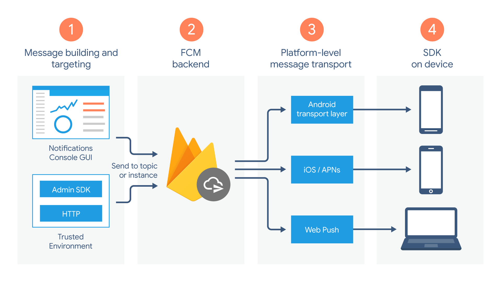

# Firebase Cloud Messaging(FCM)

Firebase Cloud Messaging(FCM)은 Google이 제공하는 클라우드 메시징 서비스로,  
개발자가 무료로기기에 푸시 알림을 보내고 데이터 메시지를 전송할 수 있도록 지원함.

## 주요 기능
1. **푸시 알림 전송**
    - iOS, Android, Web 애플리케이션과 같이 다양한 플랫폼에 푸시 알림을 보낼 수 있음.


2. **데이터 메시지 전송**
    - 백그라운드에서 동작하는 앱에 데이터를 포함한 메시지를 보낼 수 있음.


3. **주제(Topics) 기반 메시징**
    - 특정 주제를 구독한 사용자들에게 메시지를 보낼 수 있음.


4. **사용자 그룹(Targeted Messaging)**
    - 특정 사용자 그룹을 대상으로 맞춤형 메시지를 보낼 수 있음.
   

5. **다양한 전송 방법 지원**
    - Firebase 콘솔 : https://console.firebase.google.com/
    - FCM REST API
    - Firebase Admin SDK

---

## FCM 동작 방식

### 1. 클라이언트 앱에서 FCM 등록
- 앱이 실행되면 FCM SDK를 이용해 **토큰(Token)** 을 요청하고, FCM 서버로부터 등록된 토큰을 발급받음.
- ```javascript
    const app = initializeApp(firebaseConfig);
    const messaging = getMessaging(app);

    getToken(messaging, {
            vapidKey: "-"
        }
    ).then((currentToken) => {
        if (currentToken) {
            console.log(currentToken);
        } else {
            console.log("No registration token available. Request permission to generate one.");
        }
    }).catch((err) => {
      console.log("An error occurred while retrieving token. ", err);
    });

### 2. FCM 서버로 메시지 전송
- 개발자는 **Firebase 콘솔** 또는 **FCM API** 를 이용해 메시지를 전송할 수 있음.
- ```java
    String message = makeMessage(requestPushDto.token(), requestPushDto.title(), requestPushDto.body());

    HttpHeaders headers = new HttpHeaders();
    headers.setBearerAuth(getAccessToken());
    headers.setContentType(MediaType.APPLICATION_JSON);

    HttpEntity<String> requestEntity = new HttpEntity<>(message, headers);

    restTemplate.exchange(
        API_URL,
        HttpMethod.POST,
        requestEntity,
        String.class).getBody();    


### 3. 클라이언트 앱에서 메시지 수신
- FCM에서 전송된 메시지는 앱에서 처리되며, 백그라운드 또는 포그라운드 상태에 따라 다르게 동작할 수 있음.
- ```javascript
  messaging.onBackgroundMessage((payload) => {
    console.log('[firebase-messaging-sw.js] Received background message ', payload);
    var title = payload.notification.title;
    var options = {
        body: payload.notification.body,
        icon: payload.notification.icon
    };
    var notification = new Notification(title,options);
});

---

## 메시지 유형
FCM은 두 가지 유형의 메시지를 제공

### 1. 알림 메시지(Notification Messages)
- **FCM이 자동 처리**하여 알림을 표시
- 백그라운드 상태일 때는 **자동으로 알림 트레이(Notification Tray)에 표시**됨

### 2. 데이터 메시지(Data Messages)
- 앱이 **직접 메시지를 처리**해야 함
- 즉, 추가필드라고 생각하면 됨
- JSON 형식으로 데이터를 포함할 수 있으며, 포그라운드 및 백그라운드에서 모두 받을 수 있음.
- ```json
  {
      "to": "APA91bHun4MxP5egoKMwt2KZFBaFUH-1RYqx...",
      "notification": {
        "body": "test",
        "title": "Hi",
        "icon": "myicon"
      },
      "data": {
          "name": "yoongyu",
          "empNo": "29631"
      }
  }


---

## FCM 메시지 전송 방법
### 1. Firebase 콘솔 사용
- Firebase 콘솔에서 손쉽게 푸시 알림을 보낼 수 있음.

### 2. REST API 사용
- `https://fcm.googleapis.com/fcm/send`
- HTTP 요청을 통해 메시지를 보낼 수 있음.

#### 예제 (FCM API 사용)
```json
POST https://fcm.googleapis.com/fcm/send
Headers:
Authorization: key=YOUR_SERVER_KEY
Content-Type: application/json

Body:
{
  "to": "device_token",
  "notification": {
    "title": "FCM Test",
    "body": "Hello, this is a test notification"
  },
  "data": {
    "key1": "value1",
    "key2": "value2"
  }
}
