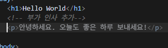
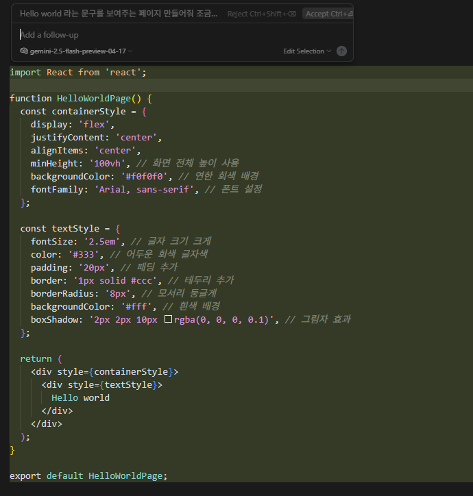
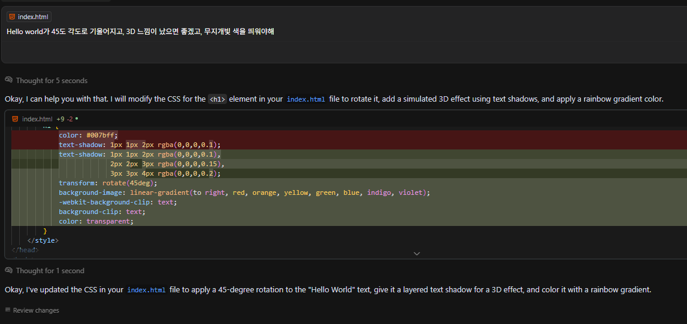
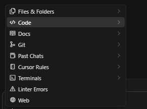
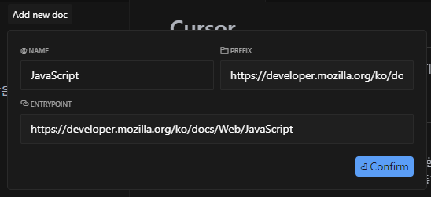
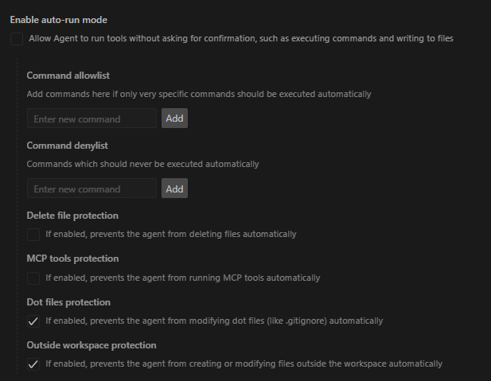

# Cursor
Cursor는 ChatGPT 기술을 통합한 VSCode 기반의 에디터로, 개발자의 생산성과 코드 품질을 획기적으로 향상시킬 수 있는 툴

## 1. Cursor란 무엇인가?

- **공식 사이트**: [https://www.cursor.so](https://www.cursor.so)
- **기반**: VSCode를 기반으로 ChatGPT API를 통합한 AI 코딩 어시스턴트 내장 에디터
- **목적**: 코드 이해, 생성, 수정, 테스트 자동화를 통해 개발 효율성 향상

### 주요 특징

- ChatGPT를 이용한 코드 설명 및 자동 생성
- 코드 리팩토링 및 버그 수정 제안
- 유닛 테스트 생성
- GitHub Copilot 대체 가능

---

## 2. 설치 및 초기 설정

### API Key 연동

- `Settings > API Key` 메뉴에서 OpenAI Key 입력
- 개인 모델 선택 가능 (e.g. GPT-4, GPT-3.5)
- 2025-05-20 기준으로는 gemini 2.5 flash preview모델 무료 사용 가능

### 기존 VS Code plugin 연동
- Cursor는 VS Code 기반이므로 대부분의 **VS Code 확장 프로그램(extension)** 과 호환
- 설치 후 초기 실행 시, 기존 VS Code 환경에서 사용하는 플러그인 목록을 자동으로 감지하고 **마이그레이션 옵션**을 제공
- 예: Prettier, ESLint, GitLens 등 자주 쓰는 확장은 별도 설치 없이 연동 가능
- 단, 일부 특정한 네이티브 기능을 요구하는 확장은 완벽히 호환되지 않을 수 있음
- 마이그레이션 과정에서 다음과 같은 옵션을 선택할 수 있음:
  - `기존 설정 유지`
  - `플러그인만 복사`
  - `완전히 새로 시작`
- 필요 시 `.vscode/extensions` 폴더에서 수동 복사도 가능
---

## 3. 주요 기능 소개

### Copilot++(Tab)
- Supermaven의 Babble 모델 인수로 가능해졌으며, 이 모델은 최대 100만 토큰 컨텍스트 창과 250ms의 낮은 지연 시간을 자랑함
- Cursor가 사용자 커서부분의 코드를 1초정도 가만히 있으면 자동완성 함

### Quick Edit(Ctrl + K):
- 특정 라인 또는 범위를 대상으로 바로바로 프롬프트를 실행할 수 있음
- 완전히 새로운 코드를 생성하고 싶으면 아무것도 선택하지 앟으면 됨
- @Codebase, @Docs 등 여러가지 심볼 설정도 가능함

### Add to Chat(Ctrl + L):
- LLM과 Chat을 할 수 있는 탭이 열림
- 현재 파일과 커서를 기준으로 하므로 '이것 실행시켜줘'이런 명령을 할 수 있음
- 또한 심볼도 동일하게 사용 가능

### @ 심볼
- @ 심볼로 검색 영역이나 범위를 변경할 수 있음

- files & folders: 특정 파일이나 폴더를 기준으로 검색
- docs: 특정 문서베이스를 기준으로 검색

- web: 인터넷 검색하여 알려줌

### Auto-Run mode(과거 YOLO 모드)

- YOLO(You Only Live Once) 모드는 AI 에이전트가 사용자의 확인 없이 자동으로 코드를 작성하고 터미널 명령을 실행할 수 있게 해주는 기능
- 이 모드를 활성화하면 AI가 코드 작성, 터미널에서의 코드 실행, 버그 수정 등을 사용자의 입력 없이 자동으로 수행
- 특정 명령어는 제외하는 게 좋음
  - rm (파일 삭제)
  - rmdir (디렉토리 삭제)
  - mv (파일 이동)
  - shutdown (시스템 종료)
  - reboot (시스템 재부팅)
  - sudo (관리자 권한으로 명령 실행)
  - ssh (원격 접속)
  - scp (원격 파일 복사)
  - curl (네트워크 요청)
  - wget (파일 다운로드)
  - git push --force (강제 푸시)
---

## 4. VSCode와의 비교

| 항목 | VSCode | Cursor |
|------|--------|--------|
| 기본 AI 기능 | 없음 (Copilot 확장 필요) | 기본 탑재 |
| 코드 분석 | 수동 디버깅 | AI 설명 + 제안 |
| 테스트 생성 | 수동 작성 | 자동 생성 가능 |
| UI/UX | 익숙함 | VSCode 기반으로 거의 동일 |
| 확장성 | 매우 풍부 | VSCode와 호환 |

---

## 5. 다른 제품 군 비교

| 툴 이름 | 기반 모델 | 통합 방식 | 주요 특징 | Cursor와의 차이점 |
|--------|-----------|-----------|-----------|------------------|
| **Cursor** | OpenAI GPT-4 / 3.5 | 자체 에디터 (VSCode 기반) | 코드 설명, 리팩토링, 테스트 생성 등 ChatGPT 중심 | 전체 에디터 자체가 AI에 최적화되어 있음 |
| **v0.dev** | OpenAI GPT-4 | 웹 기반 UI 생성기 | Figma 스타일 웹 UI 코드 자동 생성 | UI 중심, 코드 전체 개발보다는 시각적 레이아웃에 특화 |
| **GitHub Copilot** | Codex (GPT 계열) | VSCode / JetBrains 확장 | 자동 완성, 함수 제안 중심 | Cursor보다 대화형 기능이 약함, 실시간 코드 리뷰 기능 없음 |
| **Amazon CodeWhisperer** | 자체 모델 (Titan) | AWS 및 VSCode 플러그인 | AWS 서비스 연동에 최적화 | AWS 환경에서 유리, 일반적인 사용성은 Cursor보다 낮음 |
| **TabNine** | 자체 ML + GPT 계열 | IDE 플러그인 | 빠른 자동 완성, 온디바이스 모델 제공 | GPT-기반 설명 기능은 약함, 속도와 사생활 중시 |
| **Continue** | Open-source + LLM 선택 가능 | VSCode 확장 | 다양한 오픈소스 모델 사용 가능 (GPT, Claude 등) | 완전 오픈소스로 커스터마이징 가능, UI는 Cursor보다 덜 직관적 |

---

### 요약

- **Cursor**: 코드 중심 + 자연어 인터페이스 강력. 전체 IDE 통합형으로 AI가 IDE의 일부처럼 작동.
- **v0.dev**: UI 중심. 디자인 → 코드 자동화에 탁월.
- **Copilot**: 자동완성 위주. 익숙한 사용자 많지만 깊이 있는 설명은 부족.
- **CodeWhisperer**: AWS 중심 프로젝트에 적합.
- **TabNine**: 속도와 사생활 중시, 간결한 자동완성 선호 시 적합.
- **Continue**: AI 커스터마이징과 오픈소스 선호자에게 유리.

---

> **실제 사용 목적에 따라 선택이 달라질 수 있음**
> 예: 팀 협업, 코드 리뷰, 테스트 자동화에는 Cursor / 개인 코딩 보조엔 Copilot / UI 프로토타입엔 v0.dev 유리

---

## 6. 한계점 및 고려사항

- **신뢰성**: AI가 생성한 코드의 정확성은 반드시 검증 필요
- **비용**: GPT-4 기반 사용 시 유료 API 요금 발생 가능
- **보안**: 민감한 코드나 데이터는 클라우드 전송 시 주의 필요
- **대용량 프로젝트**: 일부 경우 로딩 속도 저하

### 프롬프트 엔지니어링 전략
Cursor는 GPT 모델을 기반으로 작동하므로 프롬프트 작성의 질이 성능에 직접적인 영향을 미침

예시 프롬프트 비교:
- Fix this code → 결과 불확실
- Fix the null pointer issue in this async function using try/catch → 정밀한 결과 도출

### Context Window 한계
* GPT의 컨텍스트 윈도우가 제한되어 있어 대형 프로젝트나 복잡한 파일에서 일부 내용 누락 가능
* 전략:
  * 함수 단위로 작업 범위 축소
  * 파일 범위 AI 사용 시 반드시 Select code 후 요청
  * 문맥 누락 방지: 관련 코드 함께 복사해서 요청