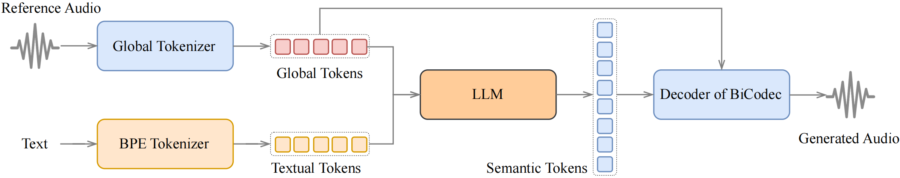
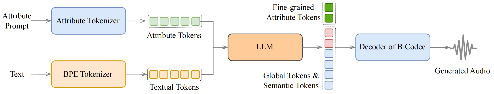

# Spark-TTS
## 개요
* 대규모 언어 모델(LLM)의 힘을 활용하여 매우 정확하고 자연스러운 음성 합성을 제공하는 고급 텍스트 음성 변환 시스템
* 연구 및 프로덕션 용도 모두에서 효율적이고 유연하며 강력한 성능을 발휘하도록 설계
## 연구 목표 및 배경
### 배경
* 기존 대규모 언어 모델(LLM) 기반의 텍스트-음성 변환(TTS) 시스템들은 다단계 처리 과정이나 병렬 코드 예측 같은 복잡한 아키텍처를 사용하여 효율성이 낮다.
* 참조 음성에만 의존하여 새로운 목소리를 창조하는 데 한계가 있었다.
* 비공개 데이터셋의 사용으로 인해 공정한 성능 비교가 어려웠다.
### 목표
* Spark-TTS라는 통합된 시스템을 통해 아키텍처를 단순화
* 제로샷 음성 복제와 포괄적인 속성 제어를 모두 달성
* 공개 데이터셋으로 재현 가능한 연구 기반을 마련하는 것을 목표
## 특징
* 단순, 효율: Qwen2.5 기반으로 완전히 구축된 Spark-TTS는 플로우 매칭과 같은 추가 생성 모델이 필요하지 않다. LLM에서 추론한 코드로 오디오를 재구성함.
* 고품질 음성 복제: zero-shot 복제를 지원하여 훈련 없이 화자의 음성을 복제할 수 있다.
* 2가지 언어지원: 중국어, 영어를 지원하며 각 언어, 코드 전환에 대한 zero-shot 음성 복제가 가능하다.
* 제어 가능: 성별, 음높이, 말하는 속도 등의 매개변수를 지원
### 음성 복제 추론

1. 입력 및 토큰화
    - 참조 음성 입력: 복제하고 싶은 목소리가 담긴 음성
      - Global Tokenizer: 음향 특성을 추출하여 압축, 이 토큰은 "이런 목소리로 말해"라는 지시와 같은 역할
    - Text 입력: 음성으로 변환하고자 하는 문장
      - BPE Tokenizer(Byte-Pair Encoding): 유사한 서브워드 기반으로 토크나이징 하는 방법
2. LLM
    - Qwen2.5 기반으로 참조 음성의 스타일로 발음하려면 어떤 소리가 순서대로 나와야하는가를 예측한다. Semantic Tokens가 결과이며 이건 설계도 같은 것
3. 디코더 및 음성 생성
    - Decoder of BiCodec: 오디어 코덱의 디코더 부분, 실제 소리로 변환하는 부분
    - 과정:
      1. LLM이 생성한 Semantic Tokens를 입력으로 받음
      2. Global tokens를 한번 더 입력으로 받음, 특징의 일관성을 유지
      3. 최종적인 음성 파형을 만들어냄 이 결과물은 입력된 텍스트 내용을 참조 음성의 목소리로 말하는 음성
### 제어 생성 추론

1. 입력 및 토큰화
    - 속성 프롬프트: 성별, 음높이, 말하는 속도 등 특징 프롬프트
      - Attribute Tokenizer: 음성의 속성을 나타내는 Attribute Tokens로 변환
    - Text 입력: 음성으로 변환하고자 하는 문장
      - BPE Tokenizer(Byte-Pair Encoding): 유사한 서브워드 기반으로 토크나이징 하는 방법
2. LLM
3. 디코더 및 음성 생성
    - Decoder of BiCodec: 오디어 코덱의 디코더 부분, 실제 소리로 변환하는 부분
    - 과정:
      1. LLM이 생성한 Global tokens & Semantic Tokens를 입력으로 받음
      2. Fine-grained Attribute Tokens (세분화된 속성 토큰)를 추가로 받음, 이는 음성을 최종 생성하는 단계에서 '깊은 목소리', '빠른 속도'와 같은 세부 속성을 더 정교하고 명확하게 반영하도록 돕는 역할
      3. 성별, 음높이, 말하는 속도 등 입력한 매개변수를 토대로 입력한 텍스트 내용을 참조 음성의 목소리로 말하는 음성을 생성
## 핵심 기술
### BiCodec
* 개념: 음성을 두 종류의 상호 보완적인 토큰으로 분리하는 단일 스트림 오디오 코덱(codec)이다.
* 구성 요소 1 - 시맨틱 토큰 (Semantic Tokens):
    * 언어적 내용을 포착하는 저용량(low-bitrate) 토큰으로, 초당 50개의 토큰(TPS)으로 생성된다.
    * 사전 학습된 wav2vec 2.0 모델의 특징(feature)을 기반으로 추출하여 높은 의미론적 연관성을 보장한다.
* 구성 요소 2 - 글로벌 토큰 (Global Tokens)
    * 화자의 음색과 같은 시간과 무관한 전역적 속성을 인코딩하는 고정 길이(32개) 토큰이다.
    * 입력 오디오의 멜 스펙트로그램(Mel spectrogram)에서 직접 추출한다.
* 양자화 (Quantization): 시맨틱 토큰에는 벡터 양자화(VQ)를, 글로벌 토큰에는 훈련 붕괴 위험이 적은 유한 스칼라 양자화(FSQ)를 적용하여 안정성을 높였다.
* 성능: 1kbps 미만의 비트레이트에서 기존의 여러 코덱을 능가하는 최첨단(SOTA) 음성 복원 품질을 달성했다.
### Spark-TTS 언어모델
* 기반 모델: 사전 학습된 텍스트 LLM인 **Qwen2.5 (0.5B 모델)**를 백본으로 사용한다.
* 통합된 아키텍처: 다단계 모델과 달리, 일반적인 텍스트 LLM과 완전히 통합된 단일 디코더-온리(decoder-only) 트랜스포머 구조를 채택했다. BiCodec 디코더가 LLM의 출력을 직접 음성 파형으로 변환하여 파이프라인을 크게 단순화시켰다.
## 데이터셋
### VoxBox
* 구성: 29개의 공개 데이터셋에서 수집 및 정제한 10만 시간 분량의 영어·중국어 음성 데이터로 구성된다.
* 특징: 모든 데이터에 대해 성별, 피치(5단계), 속도(5단계) 등의 속성 정보를 체계적으로 부착하여 제어 모델 학습의 기반을 제공한다.
## 성능 평가
* 음성 제어: 성별 제어 정확도에서 99.77%를 달성하여 타 모델을 크게 능가했으며, 지정된 피치 및 속도 값을 정확하게 반영함을 확인했다.
* 제로샷 TTS: 훨씬 적은 파라미터(0.5B)와 훈련 데이터(100k 시간)를 사용했음에도, 거대 모델(Llasa 8B, 250k 시간)보다 우수한 성능을 보였다. 음성 품질(UTMOS) 역시 기존 SOTA 오픈소스 모델인 CosyVoice2보다 높게 측정되었다.
## 한계 및 향후 과제
* 한계점: 제로샷 TTS의 화자 유사성 측면에서 다단계 모델보다는 다소 약한 성능을 보인다. 이는 자기회귀(AR) 모델의 추론 과정에서 발생하는 무작위성 때문일 수 있다.
* 향후 과제: 글로벌 토큰과 시맨틱 토큰 간의 분리를 더 강화하여 음색 제어 능력을 높이고 화자 유사성을 개선할 계획

## 참고
https://arxiv.org/pdf/2503.01710
https://huggingface.co/datasets/SparkAudio/voxbox
https://huggingface.co/SparkAudio/Spark-TTS-0.5B